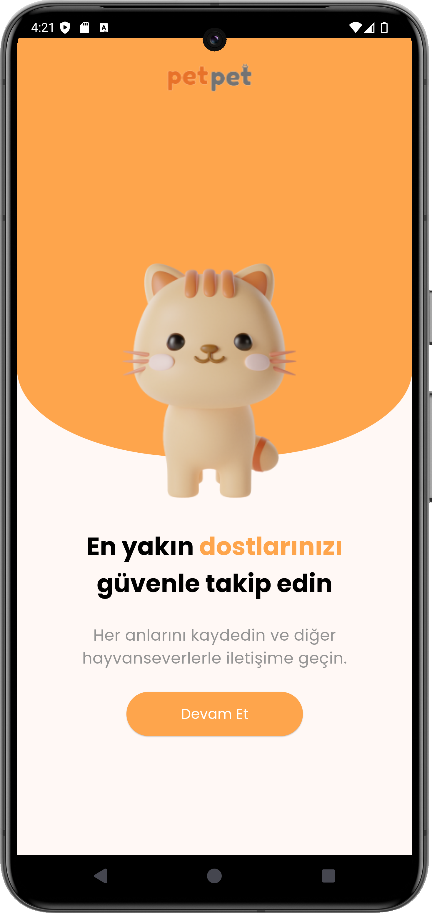
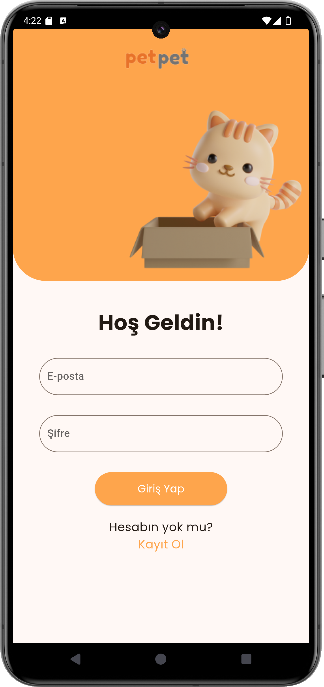

# Oyun ve Uygulama Akademisi Flutter Grup 30

## İçindekiler
1. [Takım İsmi](https://github.com/utkuq/oua_bootcamp_grup_30?tab=readme-ov-file#tak%C4%B1m-i%CC%87smi-flutter-grup-30)
2. [Takım Elemanları & Rolleri](https://github.com/utkuq/oua_bootcamp_grup_30?tab=readme-ov-file#tak%C4%B1m-elemanlar%C4%B1--rolleri)
3. [Ürün İsmi](https://github.com/utkuq/oua_bootcamp_grup_30?tab=readme-ov-file#%C3%BCr%C3%BCn-i%CC%87smi)
4. [Product Backlog URL](https://github.com/utkuq/oua_bootcamp_grup_30?tab=readme-ov-file#product-backlog-url)
5. [Ürün Açıklaması](https://github.com/utkuq/oua_bootcamp_grup_30?tab=readme-ov-file#%C3%BCr%C3%BCn-a%C3%A7%C4%B1klamas%C4%B1)
6. [Hedef Kitle](https://github.com/utkuq/oua_bootcamp_grup_30?tab=readme-ov-file#hedef-kitle)
7. [Sprint Detayları](https://github.com/utkuq/oua_bootcamp_grup_30?tab=readme-ov-file#sprint-detaylar%C4%B1)
8. [Ekran Görüntüleri](https://github.com/utkuq/oua_bootcamp_grup_30?tab=readme-ov-file#ekran-g%C3%B6r%C3%BCnt%C3%BCleri)

## Takım İsmi: Flutter Grup 30

## Takım Elemanları & Rolleri
**Ü. Şuara ALBAYRAK** Scrum Master, UX/UI Designer  
**Şevval ÖZKAYA** Product Owner, UX/UI Designer  
**Senanur KÖSE** Developer  
**Utku KARATAŞ** Developer  
**Sena ÖZİLBAN** Developer  

## Ürün İsmi
PETPET

## Product Backlog URL
[Miro App Link](https://miro.com/app/board/uXjVK2fFDSE=/?share_link_id=901564641638)

## Ürün Açıklaması
Geliştirilmesi planlanan ürün, evcil hayvan sahiplerinin dostlarını güvenle takip etmesi ve diğer hayvanseverlerle iletişim halinde olmasını sağlamak üzere tasarlanacak.    

**Uygulama birincil fonksiyonu:** Evcil hayvan/ hayvanlar sahipleri hayvanlarının kontrol altında tutulması ve takip edilmesi gereken özelliklerini uygulamaya kaydeder, buradan veteriner kontrol günlerini,hayvanlarının Tarım Ve Hayvancılık'a kayıtlı çip kodlarını, varsa kronik rahatsızlarını ve özel gereksinimlerini, yaklaşan aşı takiplerini kontrol eder.    

**Uygulama ikincil fonksiyonu:** Kullanıcı uygulama üzerinden hayvanlarla ilgili sosyal bir ağa dahil olur, diğer hayvan sahiplerinin paylaşımlarını takip eder, hayvan sahiplendirme ilanları, kayıp ilanları ve veteriner yorumları gibi gerçekçi paylaşımlarla bilgi sahini olur.   

**Ürün Özellikleri:**
- Kullanıcının evcil hayvanının özelliklerini sisteme kaydetmesi ve buradan kontrol sağlaması. 

- Birden fazla evcil hayvanı olan kullanıcıların hatırlatıcı bildirimlerle hayvanlarının takiplerini doğru şekilde yapabilmesi. 

- Uygulama içerisinde bulunan sosyal paylaşım ağında kullanıcının çevresindeki ortak ilgi alanına sahip olduğu diğer kullanıcılarla sosyal bir etkileşime girmesi. 

- Tamamen gerçek kullanıcılar tarafından yapılmış, maddi bir amaç gütmeyen kişilerin yorumlarını okuyup kendi deneyimlerini özgürce paylaşabileceği bir sosyal ağa dahil olması. 

- Hayvan sahiplenmek isteyen kulanıcılarla hayvan sahiplendirmek isteyen kullanıcıların birbirleriyle direkt iletişime geçmesi, gönüllü hayvan takibi yapan kuruluşlarla gönüllülük hizmetlerine katılmak isteyenlerin bir araya gelmesi. 

## Hedef Kitle
- Evcil hayvan sahipleri
- Hayvan sahiplenmek isteyen kişiler
- Gönüllü hayvanseverler
- Hayvanlar için üretim yapan firmalar
  
## Sprint Detayları
- ### [Sprint 1](sprint_files/sprint_1/sprint_1.md)
- ### [Sprint 2](sprint_files/sprint_2/sprint_2.md)

## Ekran Görüntüleri
|        Hoş Geldiniz Ekranı         |            Giriş Ekranı            |
| :--------------------------------: | :--------------------------------: |
|  |  |