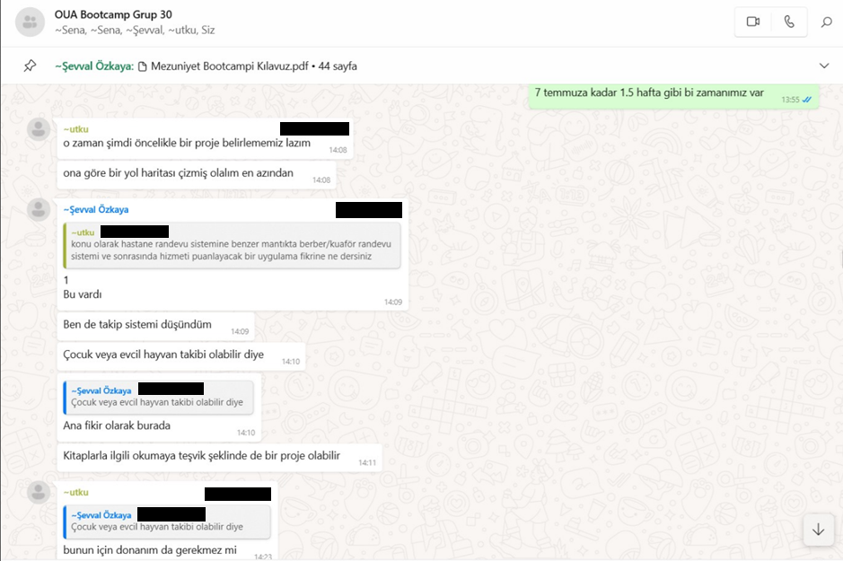
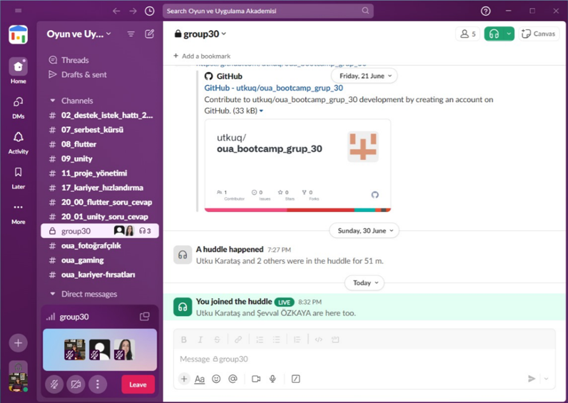
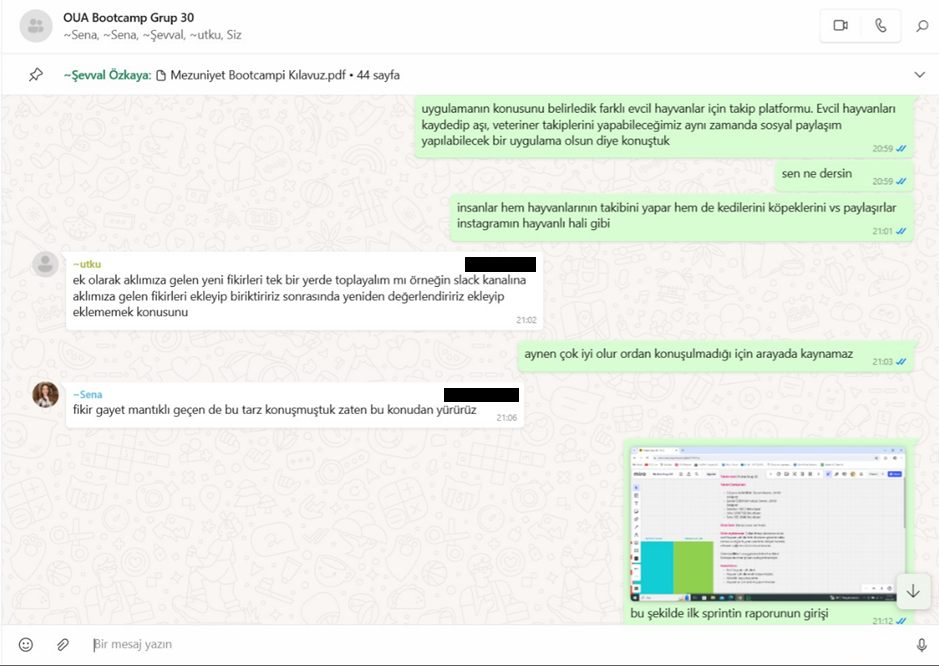
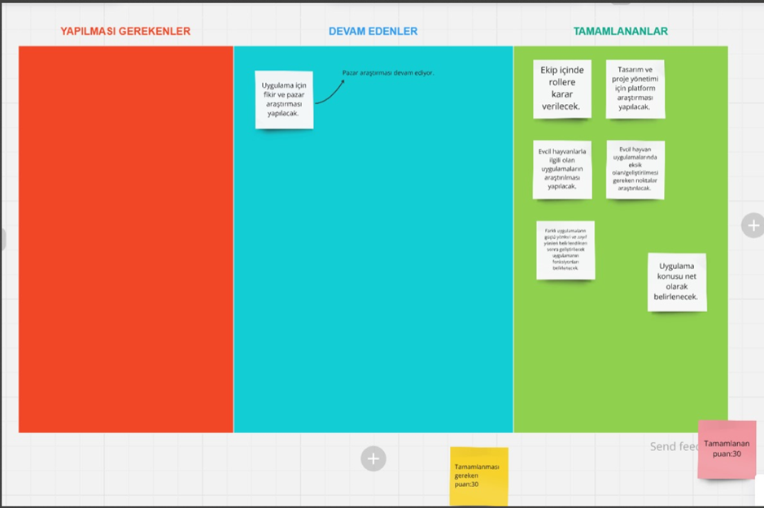

# Flutter Grup 30 Sprint 1

**Sprint içinde tamamlanması tahmin edilen puan:** 30 puan

**Puan tamamlama mantığı:** Toplamda proje boyunca tamamlanması gereken 100 puanlık backlog bulunmaktadır. 3 sprint'e bölündüğünde ilk sprint için 30 puanla başlaması gerektiğine karar verildi.

**Sprint başlatma toplantısı notları:**
- Ekip üyelerinin hangi alanda yetkin oldukları konuşuldu
- Rol dağıtımı yapıldı
- Uygulama üzerine ekip üyeleri ilk fikirlerini paylaştı
- Proje yönetimi için Miro uygulaması kullanılmasına karar verildi
- Arayüz tasarımları için Figma kullanılmasına karar verildi
- Bir sonraki detaylı toplantıya kadar fikir ve pazar araştırması yapılması üzerine sözleşildi.

**Daily Scrum:** Toplantıların zamansal sebeplerden ötürü WhatsApp üzerinden yapılmasına karar verilmiştir. Daily scrum örneği tarafımızdan paylaşılmaktadır.

## Sprint Board Update

## Ürün Durumu
**Uygulama Fikirleri:**
1. Evcil hayvanların sağlık izlemesi
2. Kuaför randevu sistemi
3. Farklı evcil hayvanlar için hatırlatıcılar, yakındaki evcil hayvanları görüntüleme ve sosyalleşme
4. Hayvan bakıcılarıyla hayvan sahiplerini buluşturan uygulama
5. Birden fazla hayvan sahibi kişiler için aşı kayıtlarını takip sistemi

**Sprint Review:**
- Takımların oluşturulmasıyla ekiple bir WhatsApp grubu kuruldu ve ekip üyelerinin teknik bilgi ve becerileri hakkında kısa bir tanışma toplantısı gerçekleştirildi.
- Sprint başlatma toplantısı ekip içindeki rol dağılımına ve süreci nasıl yürüteceğimize yönelik konuşuldu.
- Geliştirebileceğimiz ürünlere yönelik araştırmalar yapıldı ve ekiple teknik olarak bootcamp boyunca ürünü getirebileceğimiz nokta rasyonel olarak ele alındı.
- İlerletebileceğimiz fikirler üzerinde durularak pazar araştırması yapıldı.

**Sprint review toplantısı katılımcıları:** Tüm ekip katılım sağladı.

**Sprint Retrospective:** Sprint bitimi sonrası gerçekleştirilecek.
