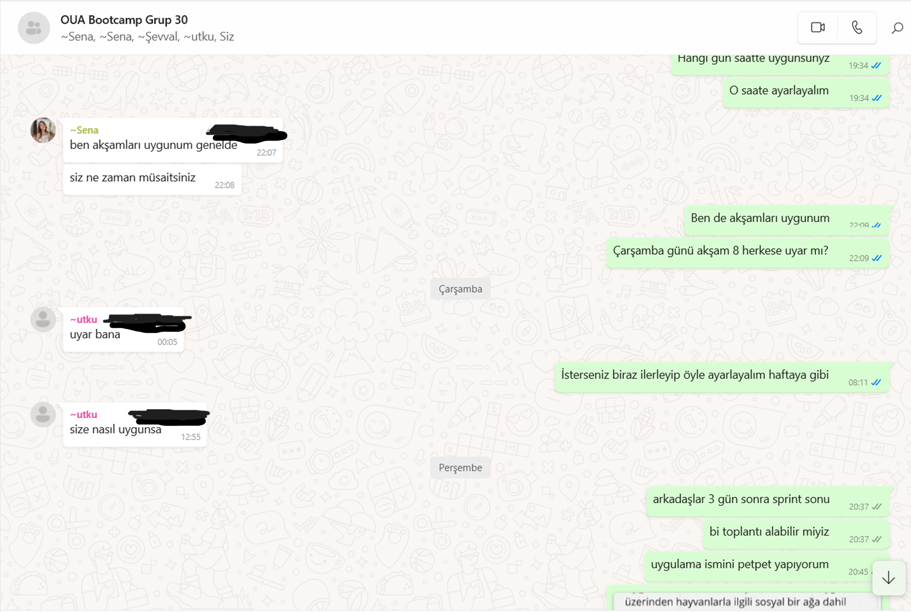
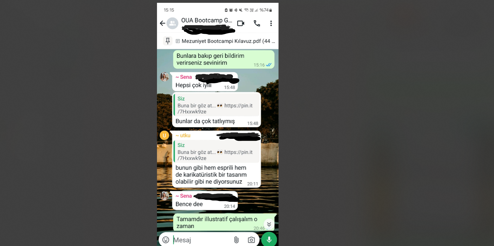
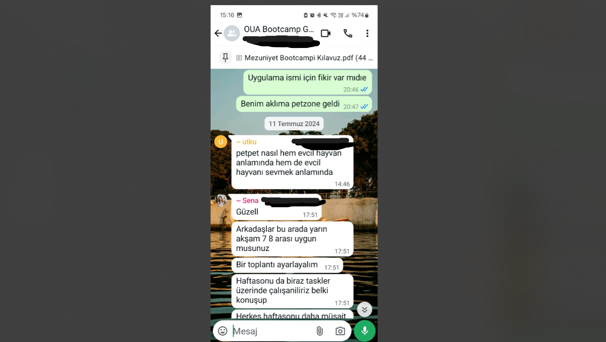
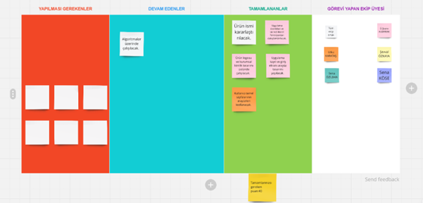
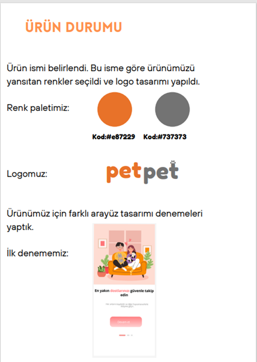
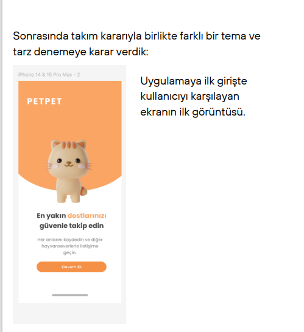
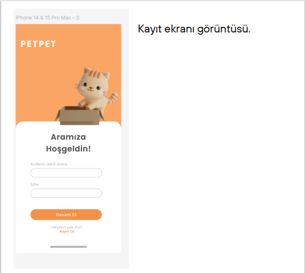

# Flutter Grup 30 Sprint 2

**Sprint içinde tamamlanması tahmin edilen puan:** 40 puan 

**Puan tamamlama mantığı:** Toplamda proje boyunca tamamlanması gereken 100 puanlık backlog bulunmaktadır. 3 sprint'e bölündüğünde ikinci sprint için 40 puanla devam edilmesi gerektiğine karar verildi.

**Sprint başlatma toplantısı notları:**
- Uygulama ana hatlarıyla konuşulduktan sonra birincil ve ikincil fonksiyonlar belirlendi, ürün detaylandırıldı.
- Uygulama isminin belirlenmesine karar verildi.
- Farklı kaynaklardan evcil hayvan içerikli uygulamaların konseptlerinin araştırılmasına karar verildi.

**Daily scrum:** Toplantıların zamansal sebeplerden ötürü Whatsapp üzerinden yapılmasına karar verilmiştir. Daily scrum örneği tarafımızdan paylaşılmaktadır.

**Sprint board update:** 

**Ürün Durumu:** 

**Sprint Review:**
- Uygulamanın kullanıcıya nasıl bir iz bırakmasını istediğimize karar verdik.
- Uygulamanın sunumunda ve içerisinde kullanacağımız temel renklere karar verdik.
- Uygulamanın giriş ekranı için Figma üzerinden arayüz tasarımı denemeleri yaptık.
- Karar verdiğimiz tasarım üzerinden ilerleyerek giriş ekranının ve kayıt ekranının tasarımlarını yaptık.
- Figma üzerinden tasarlanmış olan arayüzler Flutter ile oluşturuldu. Flutter ile hazırlanan arayüz görselleri ana [readme](../../README.md) dosyası üzerinden incelenebilir.

**Sprint Review toplantısı katılımcıları:** Tüm ekip katılım sağladı.

**Sprint Retrospective:** Sprint sonunda yapılacak.
