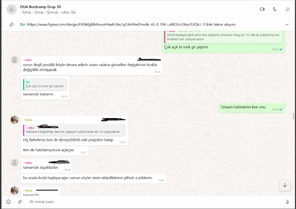
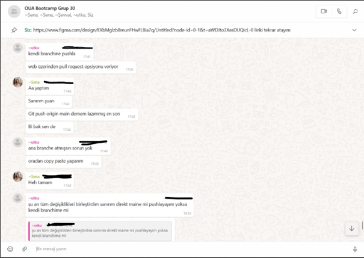
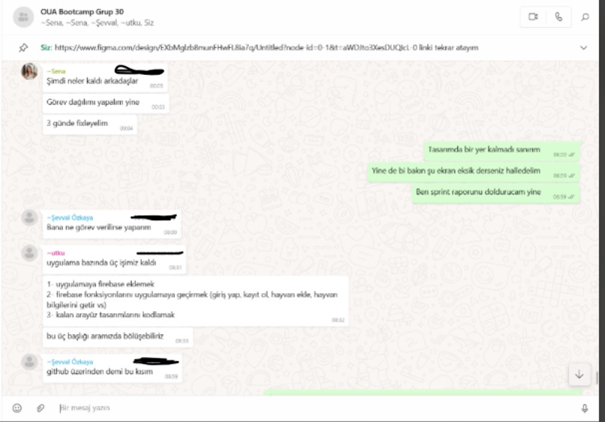
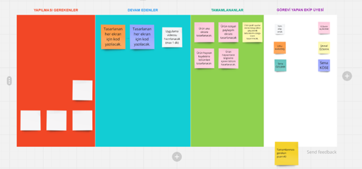

# Flutter Grup 30 Sprint 3
**Sprint içinde tamamlanması tahmin edilen puan:** 40 puan

**Puan tamamlama mantığı:** Toplamda proje boyunca tamamlanması gereken 100 puanlık backlog bulunmaktadır. 3 sprint'e bölündüğünde son sprint içinde 40 puan tamamlamamız gerekmektedir.

**Sprint notları:**
- Uygulama tasarlanırken hangi ekranları kimin tasarlayacağı paylaştırıldı.
- Uygulamanın birincil fonksiyonuna göre hayvan ekleme ekranı, hayvanların hangi bilgilerinin ekleneceği tartışıldı ve belirlendi.
- Uygulama özelinde olacak olan paylaşım ağının detayları konuşuldu.
- Uygulama girişinden sonra kayıt ekranında kullanıcının hangi amaçla uygulamayı kullanacağı konusunda daha özelleştirilmiş bir deneyim sunmak için neler yapılacağı konuşuldu.
- Kod yazma kısmında tasarımda hangi detayların değiştirebileceği konuşuldu.
- Figma üzerinden yapılan tasarımların kodlanması kısmı developer takımı arasında paylaştırıldı.
- Uygulamanın son teslim tarihinden önce bitirilmesi kararlaştırıldı.

**Daily scrum:** Toplantıların zamansal sebeplerden ötürü Whatsapp üzerinden yapılmasına karar verilmiştir. Daily scrum örneği tarafımızdan paylaşılmaktadır. 

**Sprint board update:** (Güncelleme devam edecektir. Son hali product backlogda bulunmaktadır.)  

**Ürün Durumu:** Ürünün başlangıç aşamasında sunmasını istediğimiz birincil ve ikincil fonksiyonlar eklenmiştir. Sunulan özellikler zamanla değişebilir ve kullanıcı deneyimine göre iyileştirilebilir. Ürünün son halinin video linki: https://youtu.be/rya28rthlsQ

**Sprint Review:**
- Uygulamanın temel hatlarına diğer sprintte karar verildiği üzere başlandı.
- Temel tasarımlar oluşturulduktan sonra developer ekibi ve designer ekibi hangi noktaların kodda sıkıntı çıkardığını ve tasarımın hangi noktalarının değişmesi gerektiği konuşuldu, gerekli düzeltmeler yapıldı.
- Ekranlar arasında geçişlerde hangi butonun hangi ekrana bağlandığı belirlendi.
- Kodlar developer ekibi tarafından yazıldı, firebase eklemesi yapıldı.
- Google harita api eklenip eklenmemesi konuşuldu.
- Tasarımlarda kullanıcı deneyimini daha da iyileştirecek değişimler yapıldı.
- Ürün videosu çekildi.
- Ürün teslim formu dolduruldu.

**Sprint review toplantısı katılımcıları:** Sena Özilban hariç tüm ekip katıldı. 

**Sprint-Bootcamp retrospective toplantısı:** Ekipçe ilk başlarda uygulama fikrine daha erken karar verip tasarımlara erkenden başlayabilirdik. Yine de bu geç kalmalara rağmen son sprint içerisinde ekibin çoğunluğu (5de 4 ü) aktif katılım gösterip ortaya bir ürün çıkarmayı başardık.
